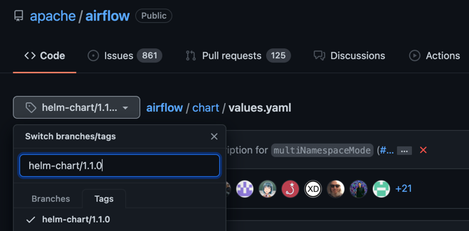

# Part 2
이번 파트에서는 Helm 을 이용하여 Airflow 2.x 를 설치해보려고 합니다.

## 어떤 Helm chart 를 써야 하나? 
설치를 시작하기 전에 설명이 필요할 것 같습니다. 현 시점에 잘 알려진 Airflow Helm Chart 는 2개입니다.
* Apache Airflow 의 공식 Helm Chart 
    * Official 이라고 볼 수 있겠네요
    * https://github.com/apache/airflow/tree/main/chart
* Github에 Mathew Wicks가 개발한 오래전부터 널리 퍼져 사용중인 Helm Chart
    * Community 버전이라고 볼 수 있겠네요. 
    * https://github.com/airflow-helm/charts/tree/main/charts/airflow

이미 많이 사용되고 있는 Airflow helm chart는 Apache Airflow에서 제공하는 공식 Airflow helm char와 별개로, Github에 이전부터 공개되어있던 helm chart가 있기도 합니다.

https://github.com/airflow-helm/charts/issues/211 이슈에 등록된 내용은, Apahce Airflow 재단에서 개중인 Jarek Potiuk과, 별개로 진행되던 Airflow Helm chart 를 만든 개인 개발자 Mathew Wicks 과의 대화를 보시면 히스토리 파악에 도움이 됩니다.

Mathew Wicks의 의견은 Airflow Helm Chart를 official로 통합하는것에 동의는 하고 있으며, 아직 일부 Official에 부족한 기능들이 있기 때문에 사용자들이 불편을 겪고 있으니, Official 기능이 충분히 좋아지면 본인이 개발중인 Helm Chart 사용자들을 독려해서 Official Airflow Helm Chart를 쓰도록 하겠다고 합니다.

어떤 Helm Chart 를 사용하건 동일한 Airflow 가 설치되지만, 설치 과정에 약간의 추가 기능 차이, Value 검증 등에서는 차이를 보입니다. 

따라서, 사용자의 판단에 맡겨 테스트 해보시고 필요한걸로 사용하셔도 아직까지는 큰 문제는 없어 보입니다.

이번 블로그 내용에서는 공식 문서에서 제공하는 helm chart 를 이용하여 설치를 해겠습니다.

## 설치 시작하기
[Airflow Helm Chart](https://airflow.apache.org/docs/helm-chart/stable/index.html) 공식 문서에 친절히 가이드가 나와있습니다.

우선 Namespace 를 생성하고, Apache Airflow helm repo 를 등록합니다.
> 작성 당시에는 Airflow Helm Chart 1.1.0 버전을 사용했습니다.<br>
> 여기서 1.1.0 버전은 Airflow의 버전이 아니라, Airflow Helm Chart 패키지 버전입니다.

```shell
$ kubectl create namespace airflow
$ helm repo add apache-airflow https://airflow.apache.org
$ helm install airflow apache-airflow/airflow --namespace airflow
```

설치가 잘 완료되었다면 아래와 같이 Pod들이 생성된 것을 볼 수 있습니다.
```shell
$ kubectl get po
NAME                                 READY   STATUS    RESTARTS   AGE
airflow-flower-7875769699-z2sv7      1/1     Running   0          2m
airflow-postgresql-0                 1/1     Running   0          2m
airflow-redis-0                      1/1     Running   0          2m
airflow-scheduler-6588b7678d-znl8k   2/2     Running   0          2m
airflow-statsd-75ff45fcbc-zb22k      1/1     Running   0          2m
airflow-webserver-79845bbb9f-5wc6k   1/1     Running   0          2m
airflow-worker-0                     2/2     Running   0          2m
```

하지만 이 상태에서 Airflow 를 쓸만한 수준으로 설정하는건 이제 시작입니다.

## value.yaml 파일 받기
Airflow Helm Chart 1.1.0 을 이용해 설치했으니, value.yaml 도 버전에 알맞게 찾아야 합니다.

<br>
*Figure 1 - 알맞는 Airflow Helm Chart 버전 Tag 찾기*

 
```shell
$ wget https://raw.githubusercontent.com/apache/airflow/helm-chart/1.1.0/chart/values.yaml
```

이제 이 values.yaml 파일을 이용해 운영환경에 맞게 개선하도록 하겠습니다.

## 외부 Database 연결하기
Airflow Helm Chart를 통해서 설치한 경우, 기본 값은 StatefulSet으로 postgresql을 설치해줍니다.
문제는 이렇게 설치된 DB의 유지보수(보안 패치, 업그레이드, 백업, 접근제어 등) 모든 내용을 직접 해결해야 합니다.
물론 회사에 DBA가 적극적으로 지원해주는게 가능하다면, Helm Chart로 설치하고 관리할 수도 있겠지만, 현실에서는 쉽지 않을 것이라 생각합니다.

공식 문서 [Production guide](https://airflow.apache.org/docs/helm-chart/stable/production-guide.html) 를 보시면 가장 첫 번째 항목이 외부 DB에 연결하는 방법을 가이드 합니다.

