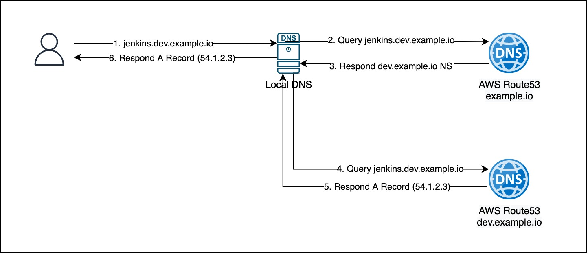
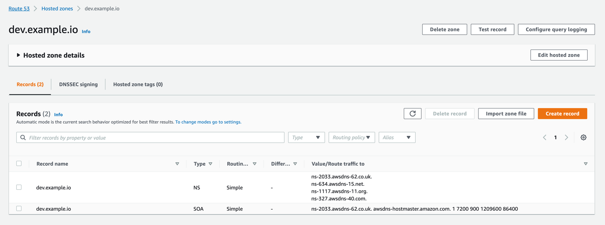
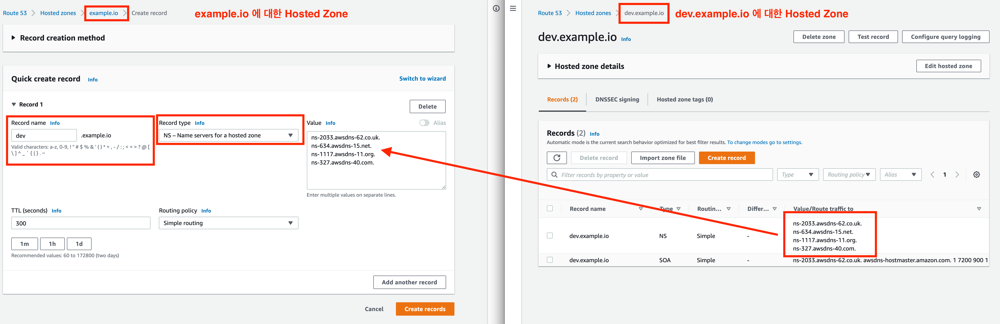
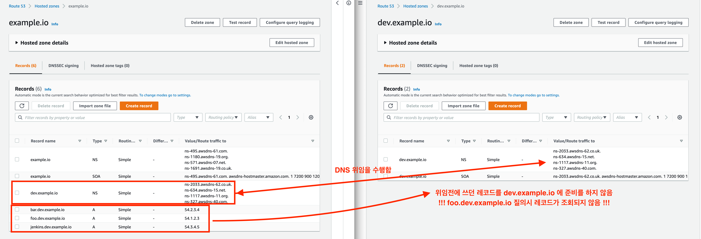
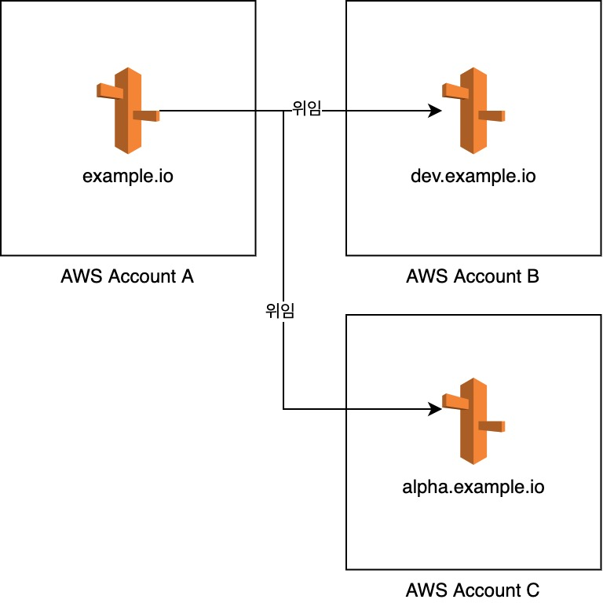

# 개요
도메인 주소를 관리를 할 때, 주로 관리의 문제를 해소, 권한 분리 등의 주로 사용할 수 있는 방법으로, DNS Delegation (DNS 위임)을 사용할 수 있습니다.

이번 내용은 AWS Route53에서 DNS 위임을 어떻게 진행하는지, 실무 환경에서 활용 방법, 위임 시 주의할 점은 무엇인지 다뤄보려고 합니다.

> 개념의 용어(Term)로, 영어는 `DNS Delegation`, `Domain Delegation`, 한글은 `도메인 위임`, `DNS 위임` 등 다양하게 쓰이는 것으로 보입니다. `Domain Delegation` 혹은 `도메인 위임`이 틀린 용어인지는 모르겠으나, `DNS Delegation` 혹은 `DNS 위임`이라는 용어를 더 많이 사용하는 것으로 보입니다,   

## DNS Delegation의 개념
DNS 위임은 상위 도메인에서 동위 혹은 하위 도메인에 대한 권한/관리를 위임하는 내용입니다.

도메인에는 `.` (root) 도메인이 존재하며, 이 하위에는 `.com`, `.net`, `.io` 등 최상위 도메인이 있으며, 일반적으로 우리가 구매하는 도메인은 이 최상위 도메인에서 구매한 `some-name.io` 같은 것이 있습니다.

위 내용을 간소하여 설명하면 `.` -> `.io` -> `some-name.io` 순으로 위임이 되어있습니다.

구매한 도메인(some-name.io)에 대해서 혹은 구매한 도메인의 sub-domain에 대해서 재위임을 할 수 있는데, 이렇게 다시 위임하여 관리의 목적을 달성할 수 있습니다.

> 실무에서 DNS 위임을 하는 목적은 위에 설명한 내용과 부합합니다. 
> 예를 들어, 개발 환경 도메인의 Hosted Zone을 분리하여, 개발팀이 좀 더 자유롭게 DNS Record를 추가하게 할 수 있습니다. 
> 혹은 DNS Record 가 너무 많은 경우, 첫 번째 sub-domain 별로 나누어 관리하는 것도 가능합니다. 

## DNS 위임하기
> 보통 도메인을 구매하면 도메인 업체 서비스에서 DNS 관리 기능을 포함합니다.

여기서부터는 우리가 구매한 도메인에 대해서 위임을 하므로, 최상위 도메인의 위임 과정은 잠시 잊고, 우리 도메인을 어떻게 위임하는지 알아보도록 하겠습니다.

DNS 위임은 `질의(DNS lookup)`해야 할 Name Server를 위임하고 싶은 서버로 지정하는 것입니다.

즉, 동위 수준에서 위임, 혹은 하위 도메인(sub-domain)을 위임하는게 가능합니다.

### DNS 질의 과정

 
*Figure 1 - DNS Query 과정 (root dns query 생략)*

예를 들어, jenkins.dev.example.io에 대해 DNS Query가 수행되는 과정을 설명했습니다.
1. 사용자 브라우저에서 jenkins.dev.example.io를 접속합니다.
2. Local DNS에서는 캐싱 된 레코드가 없을 수 있고, AWS Route53의 Hosted Zone으로 관리하는 Name Server로 질의를 합니다.
3. example.io 도메인에 대한 Hosted Zone에는 dev.example.io에 대한 Name Server(NS) 레코드를 가지고 있기에, 다른 Name Server 주소를 반환합니다.
4. dev.example.io Hosted Zone에 다시 질의를 합니다.
5. jenkins.dev.example.io의 A레코드가 존재한다면 이를 응답합니다.
6. Local DNS는 다시 브라우저에 IP 정보를 응답합니다.

### Route53에서 DNS 위임
내가 소유한 도메인 내에서 DNS 위임은 매우 간단합니다. 
example.io 도메인을 내가 직접 소유하고, Route53의 Hosted Zone으로 관리한다고 가정하겠습니다. 
dev.example.io 도메인을 만들고, 이를 별도의 Hosted Zone에 관리하도록 하려면 아래와 같이 진행하면 됩니다.

1. dev.example.io 도메인에 대한 Hosted Zone 생성
2. dev.example.io Hosted Zone을 확인하면 NS 레코드가 있습니다.
    
   *Figure 2 - dev.example.io의 NS 레코드*
     
3. 이 dev.example.io 에 대한 NS 레코드를 example.io에 추가합니다.
    
   *Figure 3 - (좌) example.io Hosted Zone / (우) dev.example.io Hosted Zone*
     

### 주의사항 - 운영 중인 서비스의 DNS 위임 시 
방법은 간단하지만 운영 중인 실제 서비스에서 위임을 할 경우, 정말 주의해야 하는 것이 있습니다.
위임하려는 sub-domain으로 끝나는 모든 레코드를, 위임할 Hosted Zone에 미리 동일하게 생성해두어야 합니다.

예를 들어, example.io Hosted Zone에 foo.dev.example.io 레코드가 이미 존재하고 있었다면, example.io에 dev.example.io NS 레코드를 추가하기 전에 dev.example.io Hosted Zone에 dev.example.io로 끝나는 모든 레코드를 준비해두어야 합니다.

 
*Figure 4 - 위임할 Hosted Zone에 레코드 준비 누락 시, 질의 불가*

### AWS Multi Account 환경에서 DNS 위임 전략
위 예시로 보신 것과 같이 DNS 위임은 그리 어려운 과정이 아닙니다.
만약 다수의 AWS 계정을 운영한다면, 최상위 root account 혹은 개별 root account에서 소유 중인 Domain을 관리하고, 계정별로 DNS 위임을 하여 관리하는 것도 좋은 전략이라 생각합니다.
 
*Figure 5 - 여러 계정을 쓸 때 위임하여 관리하기*

## 마무리
DNS 관리는 보통 시스템 엔지니어 혹은 네트워크 엔지니어 등 인프라 조직에서 주로 하다 보니, 개발자가 흔히 하는 업무는 아닐 수 있습니다.
하지만 개념이 그리 어렵지 않고, 과정도 매우 쉽기 때문에 알아두면 사용하기 좋은 전략이 될 수 있습니다.

작은 조직에서 개발팀이 DNS 관리까지 하는 경우라면, 미리 위임 전략을 고민하고 시작하면 훗날 위임 시 레코드 마이그레이션을 하는 번거로움을 줄일 수 있습니다.

준비가 된다면 AWS Route53의 Hosted Zone 간 Record Sync를 맞추는 스크립트를 공개해 보겠습니다.

### 관련 문서
* https://docs.aws.amazon.com/Route53/latest/DeveloperGuide/CreatingNewSubdomain.html
* https://docs.microsoft.com/en-us/windows-server/identity/ad-ds/plan/reviewing-dns-concepts#delegation
* https://docs.microsoft.com/ko-kr/azure/dns/dns-domain-delegation
